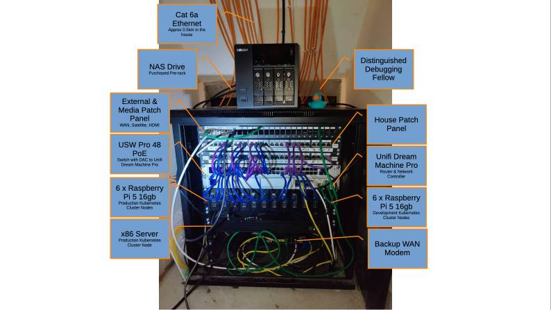

[//]: # (STANDARD README)
[//]: # (https://github.com/RichardLitt/standard-readme)
[//]: # (----------------------------------------------)
[//]: # (Uncomment optional sections as required)
[//]: # (----------------------------------------------)

[//]: # (Title)
[//]: # (Match repository name)
[//]: # (REQUIRED)

# kubernetes-lab

[//]: # (Banner)
[//]: # (OPTIONAL)
[//]: # (Must not have its own title)
[//]: # (Must link to local image in current repository)

[//]: # (Badges)
[//]: # (OPTIONAL)
[//]: # (Must not have its own title)

[//]: # (Short description)
[//]: # (REQUIRED)
[//]: # (An overview of the intentions of this repo)
[//]: # (Must not have its own title)
[//]: # (Must be less than 120 characters)
[//]: # (Must match GitHub's description)

Our Kubernetes Lab

[//]: # (Long Description)
[//]: # (OPTIONAL)
[//]: # (Must not have its own title)
[//]: # (A detailed description of the repo)

A collection of repositories forming a CNCF-aligned, bare-metal Kubernetes platform.

## Table of Contents

[//]: # (REQUIRED)
[//]: # (Managed by TOCGEN)

[//]: # (TOCGEN_TABLE_OF_CONTENTS_START)

[//]: # (TOCGEN_TABLE_OF_CONTENTS_END)

## Security
[//]: # (OPTIONAL)
[//]: # (May go here if it is important to highlight security concerns.)

The Kubernetes Lab is currently only available via VPN. 

## Background
[//]: # (OPTIONAL)
[//]: # (Explain the motivation and abstract dependencies for this repo)

The intention of this lab environment is to offer members the opportunity to experiment on a production-like Kubernetes
cluster without the restrictions of a live production environment. This allows us to purposefully break things, trial
new software, explore new structures and generally do stuff that is not "boring and dependable".

This repos serves at the hub for the others that configure all aspects of the cluster.

| Repository                                                                                | Purpose                                             |
|-------------------------------------------------------------------------------------------|-----------------------------------------------------|
| [kubernetes-lab](https://github.com/evoteum/kubernetes-lab)                               | Documentation, ADRs, portfolio index. You are here! |
| [kubernetes-lab-bootstrap](https://github.com/evoteum/kubernetes-lab-bootstrap)           | Brings up the cluster (Ansible)                     |
| [kubernetes-lab-infrastructure](https://github.com/evoteum/kubernetes-lab-infrastructure) | Long-lived infra (OpenTofu)                         |
| [kubernetes-lab-config](https://github.com/evoteum/kubernetes-lab-config)                 | Argo CD GitOps configuration                        |
| [kubernetes-lab-services](https://github.com/evoteum/kubernetes-lab-services)             | Workloads and operational apps                      |

## Install

[//]: # (Explain how to install the thing.)
[//]: # (OPTIONAL IF documentation repo)
[//]: # (ELSE REQUIRED)

See [kubernetes-lab-bootstrap](https://github.com/evoteum/kubernetes-lab-bootstrap)

## Usage
[//]: # (REQUIRED)
[//]: # (Explain what the thing does. Use screenshots and/or videos.)

Add your username and public SSH key to users.yaml then you can `kubectl` to your hearts content.

[//]: # (Extra sections)
[//]: # (OPTIONAL)
[//]: # (This should not be called "Extra Sections".)
[//]: # (This is a space for ≥0 sections to be included,)
[//]: # (each of which must have their own titles.)

## Core Components of the Lab

### Metal Lab

The [kubernetes-lab-bootstrap](https://github.com/evoteum/kubernetes-lab-bootstrap) uses Ansible to build and maintain a
highly available, multi-architecture kubernetes cluster. It runs kubeadm on Ubuntu, a combination that is widely used
across the industry. It also provisions Cilium as the CNI and ArgoCD to handle the management of everything else from
that point using GitOps. Configures ArgoCD to use the
[kubernetes-lab-config](https://github.com/evoteum/kubernetes-lab-config) repository.

Three playbooks are provided,
- build: empty Ubuntu to HA Kubernetes
- destroy: HA Kubernetes to empty Ubuntu
- rebuild: HA Kubernetes to empty Ubuntu to HA Kubernetes

Rebuild reliability has been validated repeatedly, so build and destroy to your hearts content. 

### Drydock

*[Learn more...](http://github.com/evoteum/drydock)*

Many modern infrastructure automation tools struggle with,
- mutable infrastructure: no guarantees that repeated deployments will be *exactly* the same.
- idempotent-ish: tries to be idempotent, but gives you the freedom to stray from the path if you wish.
- no takesies-backsies: rollbacks can be challenging.
- drift: if someone or something does something outside of your code, it will not be actively detected.
- operating system provisioning: It is generally assumed that you already have an operating system in place, but if you
  have just purchased 3 new servers, or perhaps 300 new servers, installing an operating system on every single one is
  a pain.

[Drydock](http://github.com/evoteum/drydock) will solve this.

We are building Drydock, a bootstrapping system that takes you from bare metal to a
fully functioning, highly available kubernetes cluster with (almost) zero human interaction. You'll get a cloud native
experience on anything from a few Raspberry Pi's to a data centre full of HPE Cray Supercomputing EX4000 nodes. 

If you happen to have an HPE Cray Supercomputing EX4000 and are willing to let us test Drydock on it, that would be
*amazing* lol

### SunshineOS

*[Learn more...](http://github.com/evoteum/SunshineOS)*

To fully automate the user experience, [Drydock](http://github.com/evoteum/drydock) needs an initial discovery operating
system that tells [Drydock](http://github.com/evoteum/drydock) all the information about the box it is running on. Named
after the small but powerful [Sunshine](https://tugs.fandom.com/wiki/Sunshine) from
[Tugs](https://en.wikipedia.org/wiki/Tugs_(TV_series)), SunshineOS will guide your machine into
[Drydock](http://github.com/evoteum/drydock) so that it can become part of the Kubernetes fleet.

### HerculesOS

*[Learn more...](http://github.com/evoteum/HerculesOS)*

Sticking with the Kubernetes maritime theme, and the [Tugs](https://en.wikipedia.org/wiki/Tugs_(TV_series)) fleet,
Drydock will send in HerculesOS when it comes time to destroy the entire cluster, or a specific node in the cluster. He
runs from RAM to ensure that nothing is left on the disk so that it is suitable for disposal or a clean rebuild. 

## Documentation

Further documentation is in the [`docs`](docs/) directory.

## Repository Configuration

> [!WARNING]  
> This repo is controlled by OpenTofu in the [estate-repos](https://github.com/evoteum/estate-repos) repository.  
>  
> Manual configuration changes will be overwritten the next time OpenTofu runs.

[//]: # (## API)
[//]: # (OPTIONAL)
[//]: # (Describe exported functions and objects)

[//]: # (## Maintainers)
[//]: # (OPTIONAL)
[//]: # (List maintainers for this repository)
[//]: # (along with one way of contacting them - GitHub link or email.)

[//]: # (## Thanks)
[//]: # (OPTIONAL)
[//]: # (State anyone or anything that significantly)
[//]: # (helped with the development of this project)

## Contributing
[//]: # (REQUIRED)
If you need any help, please log an issue and one of our team will get back to you.

PRs are welcome.

## License
[//]: # (REQUIRED)

### Code

All source code in this repository is licenced under the [GNU Affero General Public License v3.0 (AGPL-3.0)](https://www.gnu.org/licenses/agpl-3.0.en.html). A copy of this is provided in the [LICENSE](LICENSE).

### Non-code content

All non-code content in this repository, including but not limited to images, diagrams or prose documentation, is licenced under the [Creative Commons Attribution-ShareAlike 4.0 International](https://creativecommons.org/licenses/by-sa/4.0/) licence.
